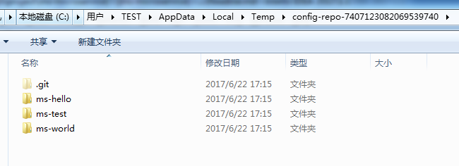
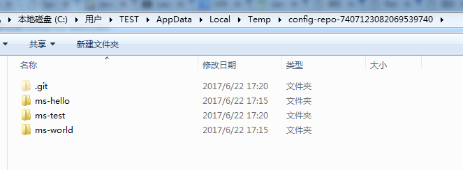

## feature
#### 1、eureka注册中心
1.5.4-RELEASE DS Replicas must use yml or else properties can't show right
#### 2、oauth2安全认证中心
#### 3、sleuth链路跟踪
#### 4、logstash日志收集
#### 5、全局异常处理
#### 6、资源服务认证
#### 7、RabbitMQ --未添加
#### 8、zuul智能路由
#### 9、turbine测量指标
#### 10、sharding-jdbc
#### 11、RocketMQ
#### 12、ff4j --灰度，蓝绿等
#### 13、ElasticSearch
#### 14、Multi-DataSource
#### 15、config文件配置中心
    1.5.4-RELEASE 新添加和修改的文件都可以及时curl出来
    项目启动时，如果不指定目录，则在临时文件目录下创建一个目录(每次重启会创建不同的目录)，例如windowsC:\Users\TEST\AppData\Local\Temp下创建
    config-repo-740712308206953
    首次curl的时候会clone所有的配置文件到此临时目录

    每次执行curl时，均会执行git命令获取最新配置（对比修改日期）

[JGit official](http://wiki.eclipse.org/JGit/User_Guide)

[JGit](http://www.importnew.com/19970.html?utm_source=tuicool&utm_medium=referral)

## ms-hello
#### exception handle
#### aspect handle
#### annotation define
#### oauth2.0 security validate
#### logstash
http://docs.spring.io/spring-boot/docs/current/reference/html/boot-features-logging.html
#### PriorityBlockingQueue
#### Schedule
http://blog.csdn.net/applebomb/article/details/52400154
#### Google guava
http://ifeve.com/google-guava/
#### Email
http://blog.csdn.net/sdmxdzb/article/details/40737931

## netty
http://ifeve.com/netty5-user-guide/

## Learn More

[Tree](docs/TREE.MD)

[Key word](docs/KeyWord.md)

[Windows cmd](docs/WindowsCMD.md)

[TCP handshake](docs/TCPhandshake.md)

[Redis菜鸟教程](http://www.runoob.com/redis/redis-sorted-sets.html)

[Elasticsearch: 权威指南](https://www.elastic.co/guide/cn/elasticsearch/guide/current/foreword_id.html)

[elasticsearch-jdbc实现MySQL同步到ElasticSearch深入详解](http://blog.csdn.net/laoyang360/article/details/51694519)

[elasticsearch-jdbc实现MySQL同步到ElasticSearch深入详解](http://blog.csdn.net/laoyang360/article/details/51694519)

## Blog

[占小狼](http://www.jianshu.com/u/90ab66c248e6)

## Specification

[规范](docs/specification.md)

#### Elastic IP
#### Amazon Route 53
云域名系统 (DNS) Web 服务

[微服务&Netflix 源码笔记](http://www.idouba.net/sping-cloud-and-netflix/)

[spring boot 启动](http://www.cnblogs.com/xinzhao/p/5551828.html)
1. ClassLoader