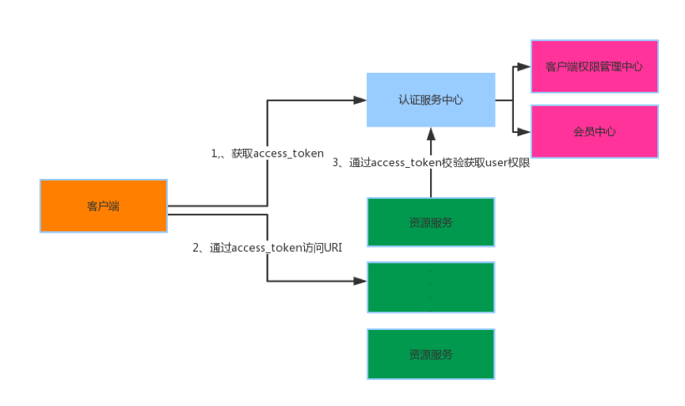

## 微服务系统安全设计说明书

* Authentication and Authorization 认证与授权
* Signature 验签
* Rate Limited 限流
* Data desensitization 数据脱敏

#### Authentication and Authorization 认证与授权

1. 场景和问题

现有服务系统，存在多个不同的应用，如果每个系统都用独立的账号认证体系，会给用户带来很大困扰，也给管理带来很大不便。所以需要设计一种统一登录的解决方案。比如我登陆了百度账号，进贴吧时发现已经登录了，进糯米发现也自动登录了。
常见的有两种情况，一种是SSO（单点登录）效果是一次输入密码多个网站可以识别在线状态；还有一种是多平台登录，效果是可以用一个账号（比如QQ账号）登录多个不同的网站。

2. 解决方案

SSO一般用于同一单位的多个站点的登陆状态保持，技术上一般参考CAS协议；多平台登录一般是Oauth体系的协议，有多种认证模式但是不具备会话管理和状态保持。
不过从本质上讲，两者都是通过可信的第三方进行身份验证，如果说同一单位的多个子系统共同只围绕一个第三方账户（可以称为认证中心）进行多平台登录验证，那么在第三方平台登录后再访问其他网站，效果和统一登录是差不多的。此外，Oauth2还有个好处就是可以实现跨平台的登录管理，因为他的认证过程不依赖于session和cookie，比如对于移动端设备，以及在前后端分离后这种登录认证方式也可以起到很大作用。

3. 技术方案

Spring Cloud Security && Oauth2.0

#### Signature 验签

1. 场景及解决问题

对于单个用户的资源访问限制已经使用认证与授权解决，但对于一些重要的资源，例如支付，兑换等资金类交易，需要防止参数篡改问题（实际上并不是必须的）

2. 技术方案

加密算法+盐值

#### Rate Limited 限流

1. 场景及解决问题

防止爬虫或肉鸡恶意攻击网站，对IP限制访问频次

2. 技术方案

IP + Redis

#### Data desensitization 数据脱敏

1. 场景及解决问题

访问用户重要信息泄漏，对一些卡号，手机号等数据进行脱敏

2. 技术方案

#### Reference
1. [微服务架构下的安全认证与鉴权](https://mp.weixin.qq.com/s/x0CZpovseOuofTA_lw0HvA)
2. [理解OAuth 2.0](http://www.ruanyifeng.com/blog/2014/05/oauth_2_0.html)
3. [服务接口API限流 Rate Limit](http://www.cnblogs.com/exceptioneye/p/4783904.html)
4. [RateLimit--使用guava来做接口限流](http://blog.csdn.net/jiesa/article/details/50412027)