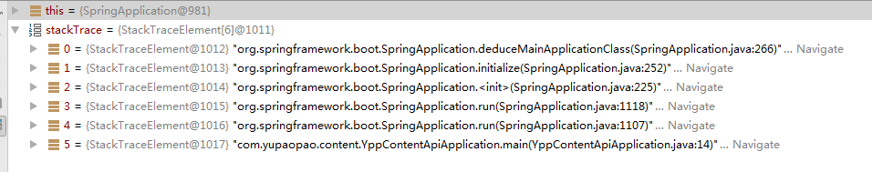
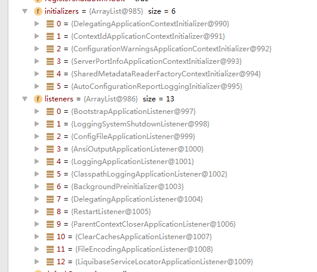
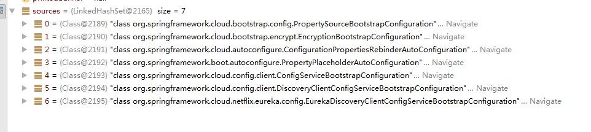

Notice : All based on version of 1.5.4.RELEASE

#### SpringApplication类的初始化

~~~
    @SpringBootApplication
    public class YppContentApiApplication {
        public static void main(String[] args) {
            SpringApplication.run(YppContentApiApplication.class, args);
        }
    }
~~~

构建ConfigurableApplicationContext上下文

~~~
    public static ConfigurableApplicationContext run(Object source, String... args) {
        return run(new Object[]{source}, args);
    }

    public static ConfigurableApplicationContext run(Object[] sources, String[] args) {
        return (new SpringApplication(sources)).run(args);
    }
~~~

SpringApplication构造函数，可以自定义资源加载器，此处使用的是第一个
~~~
    public SpringApplication(Object... sources) {
        initialize(sources);
    }
    
	public SpringApplication(ResourceLoader resourceLoader, Object... sources) {
		this.resourceLoader = resourceLoader;
		initialize(sources);
	}
~~~

初始化YppContentApiApplication.class
~~~
    private void initialize(Object[] sources) {
        if(sources != null && sources.length > 0) {
            this.sources.addAll(Arrays.asList(sources));
        }

        this.webEnvironment = this.deduceWebEnvironment();
        this.setInitializers(this.getSpringFactoriesInstances(ApplicationContextInitializer.class));
        this.setListeners(this.getSpringFactoriesInstances(ApplicationListener.class));
        this.mainApplicationClass = this.deduceMainApplicationClass();
    }
~~~
推导是否是web项目，true
~~~
	private boolean deduceWebEnvironment() {
		for (String className : WEB_ENVIRONMENT_CLASSES) {
			if (!ClassUtils.isPresent(className, null)) {
				return false;
			}
		}
		return true;
	}
	
    private static final String[] WEB_ENVIRONMENT_CLASSES = { "javax.servlet.Servlet",
            "org.springframework.web.context.ConfigurableWebApplicationContext" };
	
~~~
ApplicationContextInitializer.class，获取当前线程的类加载器
~~~
	private <T> Collection<? extends T> getSpringFactoriesInstances(Class<T> type) {
		return getSpringFactoriesInstances(type, new Class<?>[] {});
	}

	private <T> Collection<? extends T> getSpringFactoriesInstances(Class<T> type,
			Class<?>[] parameterTypes, Object... args) {
		ClassLoader classLoader = Thread.currentThread().getContextClassLoader();
		// Use names and ensure unique to protect against duplicates
		Set<String> names = new LinkedHashSet<String>(
				SpringFactoriesLoader.loadFactoryNames(type, classLoader));
		List<T> instances = createSpringFactoriesInstances(type, parameterTypes,
				classLoader, args, names);
		AnnotationAwareOrderComparator.sort(instances);
		return instances;
	}
~~~
获取META-INF/spring.factories资源路径，返回文件中标明的所有制定类及其子类
~~~
	public static List<String> loadFactoryNames(Class<?> factoryClass, ClassLoader classLoader) {
		String factoryClassName = factoryClass.getName();
		try {
			Enumeration<URL> urls = (classLoader != null ? classLoader.getResources(FACTORIES_RESOURCE_LOCATION) :
					ClassLoader.getSystemResources(FACTORIES_RESOURCE_LOCATION));
			List<String> result = new ArrayList<String>();
			while (urls.hasMoreElements()) {
				URL url = urls.nextElement();
				Properties properties = PropertiesLoaderUtils.loadProperties(new UrlResource(url));
				String factoryClassNames = properties.getProperty(factoryClassName);
				result.addAll(Arrays.asList(StringUtils.commaDelimitedListToStringArray(factoryClassNames)));
			}
			return result;
		}
		catch (IOException ex) {
			throw new IllegalArgumentException("Unable to load [" + factoryClass.getName() +
					"] factories from location [" + FACTORIES_RESOURCE_LOCATION + "]", ex);
		}
	}
	
	public static final String FACTORIES_RESOURCE_LOCATION = "META-INF/spring.factories";
~~~
例如spring-cloud-netflix-core:
~~~
org.springframework.boot.autoconfigure.EnableAutoConfiguration=\
org.springframework.cloud.netflix.archaius.ArchaiusAutoConfiguration,\
org.springframework.cloud.netflix.feign.ribbon.FeignRibbonClientAutoConfiguration,\
org.springframework.cloud.netflix.feign.FeignAutoConfiguration,\
org.springframework.cloud.netflix.feign.encoding.FeignAcceptGzipEncodingAutoConfiguration,\
org.springframework.cloud.netflix.feign.encoding.FeignContentGzipEncodingAutoConfiguration,\
org.springframework.cloud.netflix.hystrix.HystrixAutoConfiguration,\
org.springframework.cloud.netflix.hystrix.security.HystrixSecurityAutoConfiguration,\
org.springframework.cloud.netflix.ribbon.RibbonAutoConfiguration,\
org.springframework.cloud.netflix.rx.RxJavaAutoConfiguration,\
org.springframework.cloud.netflix.metrics.servo.ServoMetricsAutoConfiguration

org.springframework.cloud.client.circuitbreaker.EnableCircuitBreaker=\
org.springframework.cloud.netflix.hystrix.HystrixCircuitBreakerConfiguration

org.springframework.boot.env.EnvironmentPostProcessor=\
org.springframework.cloud.netflix.metrics.ServoEnvironmentPostProcessor
~~~
类加载器与类实例化（Class.forName(xxx.xx.xx)的作用是要求JVM查找并加载指定的类），并按照Order注解排序
isAssignableFrom 是用来判断一个类Class1和另一个类Class2是否相同或是另一个类的超类或接口。
~~~
    public static Class<?> forName(String name, ClassLoader classLoader) throws ClassNotFoundException, LinkageError
~~~
~~~
	@SuppressWarnings("unchecked")
	private <T> List<T> createSpringFactoriesInstances(Class<T> type,
			Class<?>[] parameterTypes, ClassLoader classLoader, Object[] args,
			Set<String> names) {
		List<T> instances = new ArrayList<T>(names.size());
		for (String name : names) {
			try {
				Class<?> instanceClass = ClassUtils.forName(name, classLoader);
				Assert.isAssignable(type, instanceClass);
				Constructor<?> constructor = instanceClass
						.getDeclaredConstructor(parameterTypes);
				T instance = (T) BeanUtils.instantiateClass(constructor, args);
				instances.add(instance);
			}
			catch (Throwable ex) {
				throw new IllegalArgumentException(
						"Cannot instantiate " + type + " : " + name, ex);
			}
		}
		return instances;
	}
~~~

根据运行时异常的栈追踪获取主类
~~~
	private Class<?> deduceMainApplicationClass() {
		try {
			StackTraceElement[] stackTrace = new RuntimeException().getStackTrace();
			for (StackTraceElement stackTraceElement : stackTrace) {
				if ("main".equals(stackTraceElement.getMethodName())) {
					return Class.forName(stackTraceElement.getClassName());
				}
			}
		}
		catch (ClassNotFoundException ex) {
			// Swallow and continue
		}
		return null;
	}
~~~

至此，加载ApplicationContextInitializer.class ， ApplicationListener.class所有子类实例

#### SpringApplication类的静态run方法

启动计时器，新建ConfigurableApplicationContext上下文，失败分析器，并且配置headless模式

[Headless 模式](http://www.oschina.net/translate/using-headless-mode-in-java-se)

[Headless 模式 官网](http://www.oracle.com/technetwork/articles/javase/headless-136834.html)

获取所有SpringApplicationRunListener子类，实际上只有EventPublishingRunListener

~~~
	public ConfigurableApplicationContext run(String... args) {
		StopWatch stopWatch = new StopWatch();
		stopWatch.start();
		ConfigurableApplicationContext context = null;
		FailureAnalyzers analyzers = null;
		configureHeadlessProperty();
		SpringApplicationRunListeners listeners = getRunListeners(args);
		listeners.starting();
		try {
			ApplicationArguments applicationArguments = new DefaultApplicationArguments(
					args);
			ConfigurableEnvironment environment = prepareEnvironment(listeners,
					applicationArguments);
			Banner printedBanner = printBanner(environment);
			context = createApplicationContext();
			analyzers = new FailureAnalyzers(context);
			prepareContext(context, environment, listeners, applicationArguments,
					printedBanner);
			refreshContext(context);
			afterRefresh(context, applicationArguments);
			listeners.finished(context, null);
			stopWatch.stop();
			if (this.logStartupInfo) {
				new StartupInfoLogger(this.mainApplicationClass)
						.logStarted(getApplicationLog(), stopWatch);
			}
			return context;
		}
		catch (Throwable ex) {
			handleRunFailure(context, listeners, analyzers, ex);
			throw new IllegalStateException(ex);
		}
	}
~~~
EventPublishingRunListener的构造函数为SpringApplication与args，所以获取了SpringApplication中所有的listener，
每个listener对ApplicationStartedEvent事件进行响应
~~~
	private SpringApplicationRunListeners getRunListeners(String[] args) {
		Class<?>[] types = new Class<?>[] { SpringApplication.class, String[].class };
		return new SpringApplicationRunListeners(logger, getSpringFactoriesInstances(
				SpringApplicationRunListener.class, types, this, args));
	}
~~~

~~~
	public EventPublishingRunListener(SpringApplication application, String[] args) {
		this.application = application;
		this.args = args;
		this.initialMulticaster = new SimpleApplicationEventMulticaster();
		for (ApplicationListener<?> listener : application.getListeners()) {
			this.initialMulticaster.addApplicationListener(listener);
		}
	}
	
		@Override
    	@SuppressWarnings("deprecation")
    	public void starting() {
    		this.initialMulticaster
    				.multicastEvent(new ApplicationStartedEvent(this.application, this.args));
    	}
~~~

构造输入参数对象，并且准备环境信息，每个listener对ApplicationEnvironmentPreparedEvent事件进行响应

~~~
    ApplicationArguments applicationArguments = new DefaultApplicationArguments(
					args);
			ConfigurableEnvironment environment = prepareEnvironment(listeners,
					applicationArguments);

	private ConfigurableEnvironment prepareEnvironment(
			SpringApplicationRunListeners listeners,
			ApplicationArguments applicationArguments) {
		// Create and configure the environment
		ConfigurableEnvironment environment = getOrCreateEnvironment();
		configureEnvironment(environment, applicationArguments.getSourceArgs());
		listeners.environmentPrepared(environment);
		if (!this.webEnvironment) {
			environment = new EnvironmentConverter(getClassLoader())
					.convertToStandardEnvironmentIfNecessary(environment);
		}
		return environment;
	}
~~~

准备好打印标语对象
~~~
Banner printedBanner = printBanner(environment);

class SpringBootBanner implements Banner {

	private static final String[] BANNER = { "",
			"  .   ____          _            __ _ _",
			" /\\\\ / ___'_ __ _ _(_)_ __  __ _ \\ \\ \\ \\",
			"( ( )\\___ | '_ | '_| | '_ \\/ _` | \\ \\ \\ \\",
			" \\\\/  ___)| |_)| | | | | || (_| |  ) ) ) )",
			"  '  |____| .__|_| |_|_| |_\\__, | / / / /",
			" =========|_|==============|___/=/_/_/_/" };

	private static final String SPRING_BOOT = " :: Spring Boot :: ";

	private static final int STRAP_LINE_SIZE = 42;

~~~

创建上下文信息
~~~
	protected ConfigurableApplicationContext createApplicationContext() {
		Class<?> contextClass = this.applicationContextClass;
		if (contextClass == null) {
			try {
				contextClass = Class.forName(this.webEnvironment
						? DEFAULT_WEB_CONTEXT_CLASS : DEFAULT_CONTEXT_CLASS);
			}
			catch (ClassNotFoundException ex) {
				throw new IllegalStateException(
						"Unable create a default ApplicationContext, "
								+ "please specify an ApplicationContextClass",
						ex);
			}
		}
		return (ConfigurableApplicationContext) BeanUtils.instantiate(contextClass);
	}
	
		public static final String DEFAULT_WEB_CONTEXT_CLASS = "org.springframework."
    			+ "boot.context.embedded.AnnotationConfigEmbeddedWebApplicationContext";
    
    	private static final String[] WEB_ENVIRONMENT_CLASSES = { "javax.servlet.Servlet",
    			"org.springframework.web.context.ConfigurableWebApplicationContext" };
	
~~~
新建对象FailureAnalyzers并且准备上下文信息

1. 设置环境变量
2. beanNameGenerator与resourceLoader都为空，所以这一步跳过
3. 每个ApplicationContextInitializer子类都对上下文做初始化操作
4. listeners做上下文准备工作，这一步什么都没做
5. 启动日志记录，使用main方法类记录
6. 注册特殊的单例类springApplicationArguments
7. 注册特殊的单例类springBootBanner
8. 获取资源配置类，并且进行加载

~~~
	private void prepareContext(ConfigurableApplicationContext context,
			ConfigurableEnvironment environment, SpringApplicationRunListeners listeners,
			ApplicationArguments applicationArguments, Banner printedBanner) {
		context.setEnvironment(environment);
		postProcessApplicationContext(context);
		applyInitializers(context);
		listeners.contextPrepared(context);
		if (this.logStartupInfo) {
			logStartupInfo(context.getParent() == null);
			logStartupProfileInfo(context);
		}

		// Add boot specific singleton beans
		context.getBeanFactory().registerSingleton("springApplicationArguments",
				applicationArguments);
		if (printedBanner != null) {
			context.getBeanFactory().registerSingleton("springBootBanner", printedBanner);
		}

		// Load the sources
		Set<Object> sources = getSources();
		Assert.notEmpty(sources, "Sources must not be empty");
		load(context, sources.toArray(new Object[sources.size()]));
		listeners.contextLoaded(context);
	}
~~~

~~~
2017-06-16 18:43:28.162  INFO [ypp-content-api,,,] 6244 --- [           main] c.y.content.YppContentApiApplication     : The following profiles are active: local
~~~

[Reference](http://www.cnblogs.com/xinzhao/p/5551828.html)