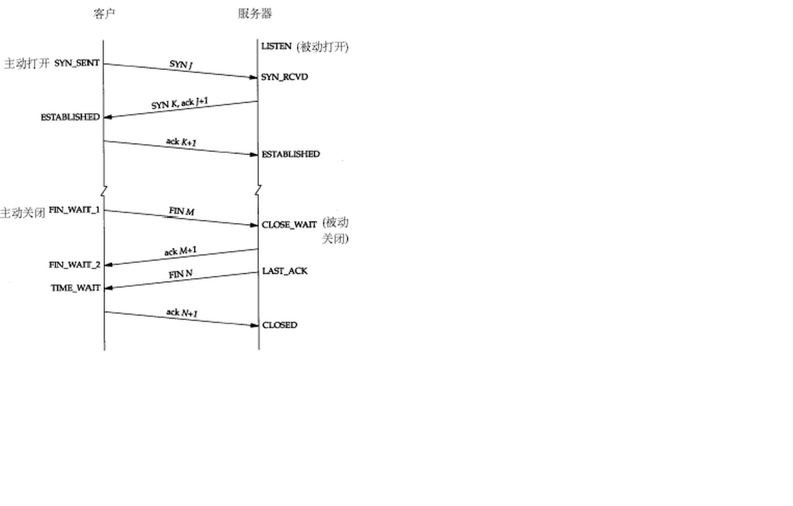
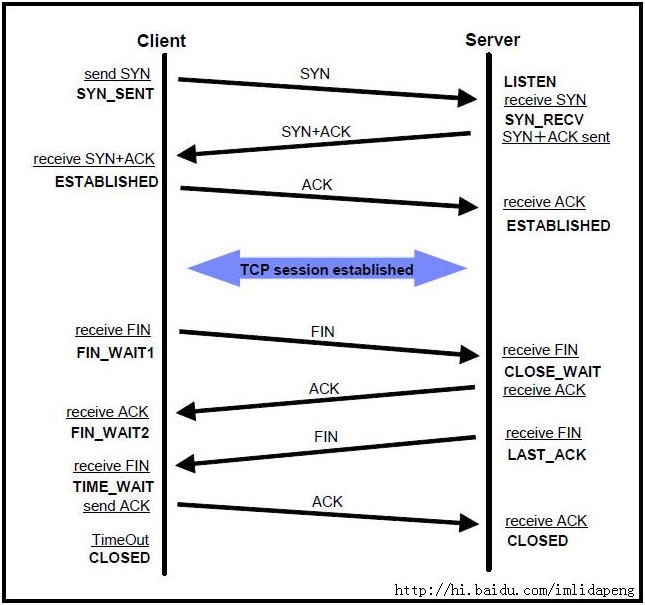

[TCP的三次握手(建立连接）和四次挥手(关闭连接）](http://www.cnblogs.com/Jessy/p/3535612.html)

#### 建立连接
理解：窗口和滑动窗口
TCP的流量控制
TCP使用窗口机制进行流量控制
什么是窗口？
连接建立时，各端分配一块缓冲区用来存储接收的数据，并将缓冲区的尺寸发送给另一端

接收方发送的确认信息中包含了自己剩余的缓冲区尺寸

剩余缓冲区空间的数量叫做窗口

#### TCP的流控过程（滑动窗口）

## TCP(Transmission Control Protocol)　传输控制协议

#### 三次握手

TCP是主机对主机层的传输控制协议，提供可靠的连接服务，采用三次握手确认建立一个连接:

位码即tcp标志位,有6种标示:

SYN(synchronous建立联机)

ACK(acknowledgement 确认)

PSH(push传送)

FIN(finish结束)

RST(reset重置)

URG(urgent紧急)

Sequence number(顺序号码)

Acknowledge number(确认号码)

#### 客户端TCP状态迁移：

CLOSED->SYN_SENT->ESTABLISHED->FIN_WAIT_1->FIN_WAIT_2->TIME_WAIT->CLOSED

#### 服务器TCP状态迁移：

CLOSED->LISTEN->SYN收到->ESTABLISHED->CLOSE_WAIT->LAST_ACK->CLOSED

####  各个状态的意义如下： 
LISTEN - 侦听来自远方TCP端口的连接请求； 

SYN-SENT -在发送连接请求后等待匹配的连接请求； 

SYN-RECEIVED - 在收到和发送一个连接请求后等待对连接请求的确认； 

ESTABLISHED- 代表一个打开的连接，数据可以传送给用户； 

FIN-WAIT-1 - 等待远程TCP的连接中断请求，或先前的连接中断请求的确认；

FIN-WAIT-2 - 从远程TCP等待连接中断请求； 

CLOSE-WAIT - 等待从本地用户发来的连接中断请求； 

CLOSING -等待远程TCP对连接中断的确认； 

LAST-ACK - 等待原来发向远程TCP的连接中断请求的确认； 

TIME-WAIT -等待足够的时间以确保远程TCP接收到连接中断请求的确认； 

CLOSED - 没有任何连接状态；

 

TCP/IP协议中，TCP协议提供可靠的连接服务，采用三次握手建立一个连接，如图1所示。

（1）第一次握手：建立连接时，客户端A发送SYN包（SYN=j）到服务器B，并进入SYN_SEND状态，等待服务器B确认。

（2）第二次握手：服务器B收到SYN包，必须确认客户A的SYN（ACK=j+1），同时自己也发送一个SYN包（SYN=k），即SYN+ACK包，此时服务器B进入SYN_RECV状态。

（3）第三次握手：客户端A收到服务器B的SYN＋ACK包，向服务器B发送确认包ACK（ACK=k+1），此包发送完毕，客户端A和服务器B进入ESTABLISHED状态，完成三次握手。

完成三次握手，客户端与服务器开始传送数据。

确认号：其数值等于发送方的发送序号 +1(即接收方期望接收的下一个序列号)。

#### TCP的包头结构：

源端口 16位

目标端口 16位

序列号 32位

回应序号 32位

TCP头长度 4位

reserved 6位

控制代码 6位

窗口大小 16位

偏移量 16位

校验和 16位

选项  32位(可选)

这样我们得出了TCP包头的最小长度，为20字节

第一次握手:

客户端发送一个TCP的SYN标志位置1的包指明客户打算连接的服务器的端口，以及初始序号X,保存在包头的序列号(Sequence Number)字段里。

第二次握手:

服务器发回确认包(ACK)应答。即SYN标志位和ACK标志位均为1同时，将确认序号(Acknowledgement Number)设置为客户的I S N加1以.即X+1。
 
第三次握手.

客户端再次发送确认包(ACK) SYN标志位为0,ACK标志位为1.并且把服务器发来ACK的序号字段+1,放在确定字段中发送给对方.并且在数据段放写ISN的+1

下面是具体的例子截图：

1.此图包含两部分信息：TCP的三次握手(方框中的内容） （SYN, (SYN+ACK), ACK)

2. TCP的数据传输 （[TCP segment of a reassembled PUD])可以看出，server是将数据TCP层对消息包进行分片传输

(1)Server端收到HTTP请求如GET之后，构造响应消息，其中携带网页内容，在server端的HTTP层发送消息200 OK->server端的TCP层； 

(2)server端的TCP层对消息包进行分片传输； 

(3)client端的TCP层对接收到的各个消息包分片回送响应； 

(4)client端的TCP层每次收到一部分都会用ACK确认，之后server继续传输，client继续确认，直到完成响应消息的所有分片之后，Server发送组合HTTP响应包 200 OK，此时在client端的消息跟踪中才可以显示HTTP 200 OK的消息包

#### 关闭连接：

由于TCP连接是全双工的，因此每个方向都必须单独进行关闭。这个原则是当一方完成它的数据发送任务后就能发送一个FIN来终止这个方向的连接。收到一个 FIN只意味着这一方向上没有数据流动，一个TCP连接在收到一个FIN后仍能发送数据。首先进行关闭的一方将执行主动关闭，而另一方执行被动关闭。

 CP的连接的拆除需要发送四个包，因此称为四次挥手(four-way handshake)。客户端或服务器均可主动发起挥手动作，在socket编程中，任何一方执行close()操作即可产生挥手操作。

（1）客户端A发送一个FIN，用来关闭客户A到服务器B的数据传送。 

（2）服务器B收到这个FIN，它发回一个ACK，确认序号为收到的序号加1。和SYN一样，一个FIN将占用一个序号。 

（3）服务器B关闭与客户端A的连接，发送一个FIN给客户端A。 

（4）客户端A发回ACK报文确认，并将确认序号设置为收到序号加1。 

TCP采用四次挥手关闭连接如图2所示。

参见wireshark抓包，实测的抓包结果并没有严格按挥手时序。我估计是时间间隔太短造成。

#### 深入理解TCP连接的释放：

由于TCP连接是全双工的，因此每个方向都必须单独进行关闭。这原则是当一方完成它的数据发送任务后就能发送一个FIN来终止这个方向的连接。收到一个 FIN只意味着这一方向上没有数据流动，一个TCP连接在收到一个FIN后仍能发送数据。首先进行关闭的一方将执行主动关闭，而另一方执行被动关闭。

TCP协议的连接是全双工连接，一个TCP连接存在双向的读写通道。 

简单说来是 “先关读，后关写”，一共需要四个阶段。以客户机发起关闭连接为例：

1.服务器读通道关闭
2.客户机写通道关闭
3.客户机读通道关闭
4.服务器写通道关闭

关闭行为是在发起方数据发送完毕之后，给对方发出一个FIN（finish）数据段。直到接收到对方发送的FIN，且对方收到了接收确认ACK之后，双方的数据通信完全结束，过程中每次接收都需要返回确认数据段ACK。
详细过程：

    第一阶段   客户机发送完数据之后，向服务器发送一个FIN数据段，序列号为i；
    1.服务器收到FIN(i)后，返回确认段ACK，序列号为i+1，关闭服务器读通道；
    2.客户机收到ACK(i+1)后，关闭客户机写通道；
    （此时，客户机仍能通过读通道读取服务器的数据，服务器仍能通过写通道写数据）
    第二阶段 服务器发送完数据之后，向客户机发送一个FIN数据段，序列号为j；
    3.客户机收到FIN(j)后，返回确认段ACK，序列号为j+1，关闭客户机读通道；
    4.服务器收到ACK(j+1)后，关闭服务器写通道。

这是标准的TCP关闭两个阶段，服务器和客户机都可以发起关闭，完全对称。

FIN标识是通过发送最后一块数据时设置的，标准的例子中，服务器还在发送数据，所以要等到发送完的时候，设置FIN（此时可称为TCP连接处于半关闭状态，因为数据仍可从被动关闭一方向主动关闭方传送）。如果在服务器收到FIN(i)时，已经没有数据需要发送，可以在返回ACK(i+1)的时候就设置FIN(j)标识，这样就相当于可以合并第二步和第三步。读《Linux网络编程》关闭TCP连接章节，作以下笔记：

TCP的TIME_WAIT和Close_Wait状态

面试时看到应聘者简历中写精通网络，TCP编程，我常问一个问题，TCP建立连接需要几次握手？95%以上的应聘者都能答对是3次。问TCP断开连接需要几次握手，70%的应聘者能答对是4次通讯。再问CLOSE_WAIT，TIME_WAIT是什么状态，怎么产生的，对服务有什么影响，如何消除？有一部分同学就回答不上来。不是我扣细节，而是在通讯为主的前端服务器上，必须有能力处理各种TCP状态。比如统计在本厂的一台前端机上高峰时间TCP连接的情况，统计命令：

    netstat -n | awk '/^tcp/ {++S[$NF]} END {for(a in S) print a, S[a]}'  
    
结果：

除了ESTABLISHED，可以看到连接数比较多的几个状态是：FIN_WAIT1, TIME_WAIT, CLOSE_WAIT, SYN_RECV和LAST_ACK；下面的文章就这几个状态的产生条件、对系统的影响以及处理方式进行简单描述。

## TCP状态

下面看下大家一般比较关心的三种TCP状态

SYN_RECV 
服务端收到建立连接的SYN没有收到ACK包的时候处在SYN_RECV状态。有两个相关系统配置：

 
1，net.ipv4.tcp_synack_retries ：INTEGER

默认值是5

对于远端的连接请求SYN，内核会发送SYN ＋ ACK数据报，以确认收到上一个 SYN连接请求包。这是所谓的三次握手( threeway handshake)机制的第二个步骤。这里决定内核在放弃连接之前所送出的 SYN+ACK 数目。不应该大于255，默认值是5，对应于180秒左右时间。通常我们不对这个值进行修改，因为我们希望TCP连接不要因为偶尔的丢包而无法建立。

2，net.ipv4.tcp_syncookies

一般服务器都会设置net.ipv4.tcp_syncookies=1来防止SYN Flood攻击。假设一个用户向服务器发送了SYN报文后突然死机或掉线，那么服务器在发出SYN+ACK应答报文后是无法收到客户端的ACK报文的（第三次握手无法完成），这种情况下服务器端一般会重试（再次发送SYN+ACK给客户端）并等待一段时间后丢弃这个未完成的连接，这段时间的长度我们称为SYN Timeout，一般来说这个时间是分钟的数量级（大约为30秒-2分钟）。

这些处在SYNC_RECV的TCP连接称为半连接，并存储在内核的半连接队列中，在内核收到对端发送的ack包时会查找半连接队列，并将符合的requst_sock信息存储到完成三次握手的连接的队列中，然后删除此半连接。大量SYNC_RECV的TCP连接会导致半连接队列溢出，这样后续的连接建立请求会被内核直接丢弃，这就是SYN Flood攻击。

能够有效防范SYN Flood攻击的手段之一，就是SYN Cookie。SYN Cookie原理由D. J. Bernstain和 Eric Schenk发明。SYN Cookie是对TCP服务器端的三次握手协议作一些修改，专门用来防范SYN Flood攻击的一种手段。它的原理是，在TCP服务器收到TCP SYN包并返回TCP SYN+ACK包时，不分配一个专门的数据区，而是根据这个SYN包计算出一个cookie值。在收到TCP ACK包时，TCP服务器在根据那个cookie值检查这个TCP ACK包的合法性。如果合法，再分配专门的数据区进行处理未来的TCP连接。

观测服务上SYN_RECV连接个数为：7314，对于一个高并发连接的通讯服务器，这个数字比较正常。

CLOSE_WAIT

发起TCP连接关闭的一方称为client，被动关闭的一方称为server。被动关闭的server收到FIN后，但未发出ACK的TCP状态是CLOSE_WAIT。出现这种状况一般都是由于server端代码的问题，如果你的服务器上出现大量CLOSE_WAIT，应该要考虑检查代码。

TIME_WAIT
根据TCP协议定义的3次握手断开连接规定,发起socket主动关闭的一方 socket将进入TIME_WAIT状态。TIME_WAIT状态将持续2个MSL(Max Segment Lifetime),在Windows下默认为4分钟，即240秒。TIME_WAIT状态下的socket不能被回收使用. 具体现象是对于一个处理大量短连接的服务器,如果是由服务器主动关闭客户端的连接，将导致服务器端存在大量的处于TIME_WAIT状态的socket， 甚至比处于Established状态下的socket多的多,严重影响服务器的处理能力，甚至耗尽可用的socket，停止服务。

为什么需要TIME_WAIT？TIME_WAIT是TCP协议用以保证被重新分配的socket不会受到之前残留的延迟重发报文影响的机制,是必要的逻辑保证。

和TIME_WAIT状态有关的系统参数有一般由3个，本厂设置如下：

    net.ipv4.tcp_tw_recycle = 1
    net.ipv4.tcp_tw_reuse = 1
    net.ipv4.tcp_fin_timeout = 30
    net.ipv4.tcp_fin_timeout，默认60s，减小fin_timeout，减少TIME_WAIT连接数量。
    net.ipv4.tcp_tw_reuse = 1表示开启重用。允许将TIME-WAIT sockets重新用于新的TCP连接，默认为0，表示关闭；
    net.ipv4.tcp_tw_recycle = 1表示开启TCP连接中TIME-WAIT sockets的快速回收，默认为0，表示关闭。

为了方便描述，我给这个TCP连接的一端起名为Client，给另外一端起名为Server。上图描述的是Client主动关闭的过程，FTP协议中就这样的。如果要描述Server主动关闭的过程，只要交换描述过程中的Server和Client就可以了，HTTP协议就是这样的。

描述过程：
Client调用close()函数，给Server发送FIN，请求关闭连接；Server收到FIN之后给Client返回确认ACK，同时关闭读通道（不清楚就去看一下shutdown和close的差别），也就是说现在不能再从这个连接上读取东西，现在read返回0。此时Server的TCP状态转化为CLOSE_WAIT状态。
Client收到对自己的FIN确认后，关闭 写通道，不再向连接中写入任何数据。
接下来Server调用close()来关闭连接，给Client发送FIN，Client收到后给Server回复ACK确认，同时Client关闭读通道，进入TIME_WAIT状态。
Server接收到Client对自己的FIN的确认ACK，关闭写通道，TCP连接转化为CLOSED，也就是关闭连接。
Client在TIME_WAIT状态下要等待最大数据段生存期的两倍，然后才进入CLOSED状态，TCP协议关闭连接过程彻底结束。

以上就是TCP协议关闭连接的过程，现在说一下TIME_WAIT状态。
从上面可以看到，主动发起关闭连接的操作的一方将达到TIME_WAIT状态，而且这个状态要保持Maximum Segment Lifetime的两倍时间。为什么要这样做而不是直接进入CLOSED状态？

原因有二：

一、保证TCP协议的全双工连接能够可靠关闭

二、保证这次连接的重复数据段从网络中消失

先说第一点，如果Client直接CLOSED了，那么由于IP协议的不可靠性或者是其它网络原因，导致Server没有收到Client最后回复的ACK。那么Server就会在超时之后继续发送FIN，此时由于Client已经CLOSED了，就找不到与重发的FIN对应的连接，最后Server就会收到RST而不是ACK，Server就会以为是连接错误把问题报告给高层。这样的情况虽然不会造成数据丢失，但是却导致TCP协议不符合可靠连接的要求。所以，Client不是直接进入CLOSED，而是要保持TIME_WAIT，当再次收到FIN的时候，能够保证对方收到ACK，最后正确的关闭连接。

再说第二点，如果Client直接CLOSED，然后又再向Server发起一个新连接，我们不能保证这个新连接与刚关闭的连接的端口号是不同的。也就是说有可能新连接和老连接的端口号是相同的。一般来说不会发生什么问题，但是还是有特殊情况出现：假设新连接和已经关闭的老连接端口号是一样的，如果前一次连接的某些数据仍然滞留在网络中，这些延迟数据在建立新连接之后才到达Server，由于新连接和老连接的端口号是一样的，又因为TCP协议判断不同连接的依据是socket pair，于是，TCP协议就认为那个延迟的数据是属于新连接的，这样就和真正的新连接的数据包发生混淆了。所以TCP连接还要在TIME_WAIT状态等待2倍MSL，这样可以保证本次连接的所有数据都从网络中消失。

各种协议都是前人千锤百炼后得到的标准，规范。从细节中都能感受到精巧和严谨。每次深入都有同一个感觉，精妙。

做个快乐的自己。

对于小白，感觉有几个地方说的太误导人。
其一：客户机发起关闭连接为例，为什么不是客户端先关闭写通道，服务器后关闭读通道？
其二：对于CLOSE_WAIT状态的描述是错的。原文说“被动关闭的server收到FIN后，但未发出ACK的TCP状态是CLOSE_WAIT”。应该是被动关闭端未发出FIN的TCP状态是CLOASE_WAIT。通常服务器收到FIN消息，不管什么情况都会立马发送ACK确认的。如果按原文说的未发出ACK是CLOSE_WAIT状态。那么相信CLOSE_WAIT状态将很少看到