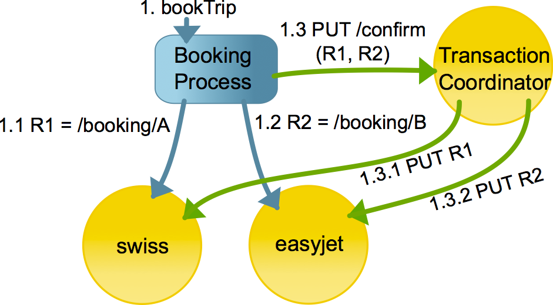

## Transaction management API for REST: TCC

下文所述是atomikos Composite Transactions 为SOA 提供的 REST API。这是世界上第一个事务协议，保证各供应商和平台的互操作性，归结于其简约的
方法与简单性。

#### 内容目录

* Context Diagram
    * Example: booking connecting flights
    * Roles
* For Service Providers: Participant API
    * Participant Responsibilities
    * Required: Autonomous Timeout and Cancel
    * Required: Participant Link
    * Required: PUT to Confirm
    * Optional: DELETE to Cancel
    * Optional: GET for Failure Diagnostics
* For Application Developers: Coordinator API
    * Coordinator Responsibilities
    * PUT to Confirm
    * PUT to Cancel
* Additional Background Information

#### Context Diagram 关系图

TCC程序示例如下所示：一个事务REST程序（订票流程）准备从不同独立的航空公司预定机票:

1. (Step 1.1 in the picture) 一个航班机票预定系统为swiss。它将在超时时间内等待确认信息，
并可以自动取消本系统的交易。在这之后，确认动作仅可发生在URI R1返回Booking process。
2. (Step 1.2 in the picture) 一个航班机票预定系统为easyjet, 同上, 确认路径为 URI R2.
3. (Step 1.3 in the picture) 订票系统可以通过调用协调者服务通过两者的URIs同时确认两个预定系统状态。
协调者服务协调所有涉及的服务的确认和恢复逻辑。

如果在3之前有任何故障，那么所有的事情都会超时并取消。如果在3后有故障，然后
一切都已经确认了。3中的任何故障都由协调服务处理，包括
崩溃和网络故障后的恢复。这将为REST服务提供事务性保证。

#### Roles

我们的API包含三个互补的部分: the participant role, the coordinator role and the application

* Participants 是那些第三方服务提供者希望他们的服务被TCC-aware (如同例子中的航班服务).
* The coordinator service 我们提供的协调服务是：一个可重用的服务来管理一致的确认（或取消）的一组相关的服务调用（包括恢复）。
* 最后，还有应用程序（the booking process）。我们对application没有要求。除此之外，它使用我们提供的方式使用我们的协调者。

> DISCLAIMER: Swiss and Easyjet are the trademarks of their respective owners.

#### For Service Providers: Participant API

在这里，我们从参与者的角度总结实际的REST API。因为参与者的实例是由第三方供应商实现,互操作只能用简约,简单,清晰的设计方式。

###### Participant Responsibilities

参与者管理业务资源预留的特定状态。默认情况下，一段时间后预留超时，除非是由应用程序（协调员）确认。

###### Required: Autonomous Timeout and Cancel 自发超时和取消

每个参与者实现必须在某些内部超时后自动取消。没有什么是永久直到参与者收到确认。

###### Required: Participant Link

每个参与者实现都必须返回参与者链接实例以进行调用。
末端确认。这些链接包含元数据，如要调用的URI（用于确认）和
参加者将自行取消的截止日期/时间。参与者链接如下形式：
~~~
{"participantLink":
     {
     "uri":"http://www.example.com/part/123",
     "expires":"2014-01-11T10:15:54Z"
     }
}
~~~
参与者链接的交换是参与者和应用程序之间的交换，在
TCC协议之外。尽管我们的示例建议JSON，但对这种数据格式没有真正的要求。
Exchange：这完全在参与者提供程序和应用程序开发人员之间达成一致。其他
还可以使用诸如链接头之类的方法。

Dates are in [ISO8601 format](https://en.wikipedia.org/wiki/ISO_8601).

###### Required: PUT to Confirm

参与者链接实例中所示的URI必须支持 PUT 操作以确认
~~~
PUT /part/123 HTTP/1.1
Host: www.example.com
Accept: application/tcc
~~~
注意请求的MIME类型，表示客户端对TCC协议语义的期望。它通常是协调服务，它将调用参与者确认。

>尽管参与者API有特定的MIME类型，但这种类型只用于指定语义。特别是，没有涉及到请求/响应的正文内容。

如果一切顺利，参与者的响应会是：
~~~
HTTP/1.1 204 No Content
~~~

如果确认请求在参与者已经超时并自行取消后到达，则参与者必须返回404错误：
~~~
HTTP/1.1 404 Not Found
~~~
任何其他的错误会引发协调服务恢复逻辑（通常在重试直到它的形式放弃）。

###### Optional: DELETE to Cancel
每个参与者URI可以选择性地实现DELETE，以接收取消的显式请求。
~~~
DELETE /part/123 HTTP/1.1
Host: www.example.com
Accept: application/tcc
~~~

唯一期待的响应会是
 
    HTTP/1.1 204 No Content
 
取消过程中的任何错误都可以忽略，不影响整个事务结果（见下面的一些典型错误）。
如果参与者本身有中间（内部）超时/取消，返回404就可以了：

    HTTP/1.1 404 Not Found

由于删除实际上是可选操作，所以有些参与者可能选择不执行它。那样的话：

    HTTP/1.1 405 Method Not Allowed

这是很好的在我们的总体设计。任何其他（例如，但不限于，MIME类型不被理解）在这里也很好。

###### Optional: GET for Failure Diagnostics

参与者服务可以实现GET访问故障诊断。在我们被简约的意图，诊断功能（目前）在我们的协议本身的范围和留给应用程序设计师，所以他们可以在每一个个案的基础上调整。

#### For Application Developers: Coordinator API

协调服务由我们实现，并由应用程序开发人员使用。因此，我们从REST接口的客户机的角度提出了协调器协议，而不是讨论协调器的实现内部结构

###### Coordinator Responsibilities

协调者核心责任如下：
1. 确认所有参与者当接收到请求时
2. 在参与者实例或协调器本身失败之后恢复，特别是在确认阶段。
3. 智能使用提供的到期日期/时间信息减少的探索（即问题）事务结果的数量。
4. 确定有问题的确认结果的正确错误
5. 很好的：当被要求时，很容易允许所有参与者取消。

###### PUT to Confirm
使用PUT协调器服务确认事务。事务实际上只是参与者链接的集合：
~~~
PUT /coordinator/confirm HTTP/1.1
Host: www.taas.com
Content-Type: application/tcc+json
{ "participantLinks": [
 {
 "uri": "http://www.example.com/part1",
 "expires": "2014-01-11T10:15:54Z"
 },
 {
 "uri": "http://www.example.com/part2",
 "expires": "2014-01-11T10:15:54+01:00"
 }
 ]
}
~~~

在此之后，协调器服务将与每个参与者联系并尝试确认。如果一切顺利的话，那么结果将是
    
    HTTP/1.1 204 No Content

如果确认请求太迟，意味着所有参与者超时并已取消，然后：
    
    HTTP/1.1 404 Not Found

最糟糕的情况是混合结果，一些与会者证实了这一点，而另一些人则没有。
这表明如下：
    
    HTTP/1.1 409 Conflict
    
当然，这个想法是尽量减少发生这种情况的数量——这是协调员职责的一个重要部分。
但是，如果发生这种情况，则取决于应用程序检查受影响的参与者，可能是通过向每个参与者URI发出GET请求。
一些手工的分辨率将被要求，其中具体是有意把这个规范允许每个应用的最佳方法。

###### PUT to Cancel

取消请求类似于确认，但协调器侦听的URI除外：
~~~
PUT /coordinator/cancel HTTP/1.1
Host: www.taas.com
Content-Type: application/tcc+json
{ "participantLinks": [
 {
 "uri": "http://www.example.com/part1",
 "expires": "2014-01-11T10:15:54Z"
 },
 {
 "uri": "http://www.example.com/part2",
 "expires": "2014-01-11T10:15:54Z"
 }
 ]
}
~~~

唯一可预见的结果是

    HTTP/1.1 204 No Content
    
任何其他结果都可以被安全地忽略，因为根据定义，没有参与者被确认，这意味着所有的工作最终都将被取消。

#### Reference
[Transaction management API for REST: TCC](https://www.atomikos.com/Blog/TransactionManagementAPIForRESTTCC)