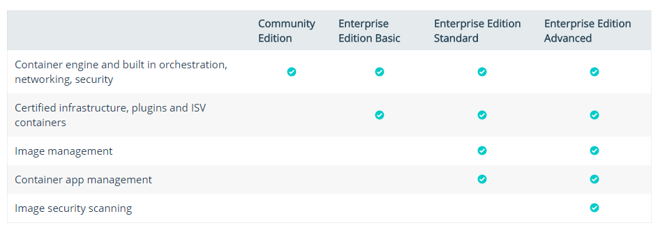
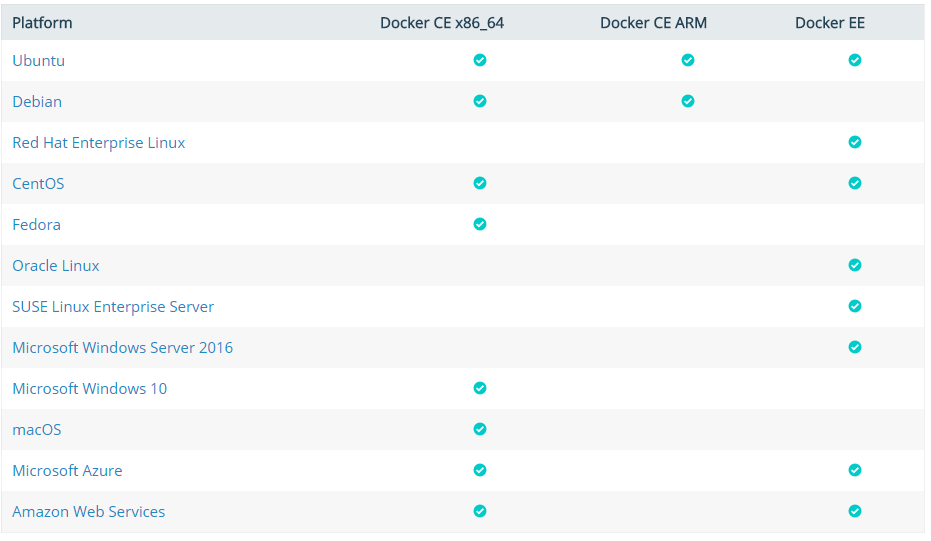

[Install Docker](https://docs.docker.com/engine/installation/)

1. community vs enterprise

2. Supported platforms

## Ubuntu

[Prerequisites](https://docs.docker.com/engine/installation/linux/docker-ce/ubuntu/)

1. version info 
~~~
    # sudo lsb_release -a
    
    LSB Version:	core-9.20160110ubuntu0.2-amd64:core-9.20160110ubuntu0.2-noarch:security-9.20160110ubuntu0.2-amd64:security-9.20160110ubuntu0.2-noarch
    Distributor ID:	Ubuntu
    Description:	Ubuntu 16.04.2 LTS
    Release:	16.04
    Codename:	xenial

~~~

2. Install Docker CE

    You can install Docker CE in different ways, depending on your needs:

** Most users set up Docker’s repositories and install from them, for ease of installation and upgrade tasks. This is the recommended approach.

** Some users download the DEB package and install it manually and manage upgrades completely manually. This is useful in situations such as installing Docker on air-gapped systems with no access to the internet.

#### Install using the repository

1. SET UP THE REPOSITORY

2. INSTALL DOCKER CE

#### Install from a package

#### Uninstall Docker CE

1. Uninstall the Docker CE package:
~~~
    $ sudo apt-get purge docker-ce
~~~

2. Images, containers, volumes, or customized configuration files on your host are not automatically removed. To delete all images, containers, and volumes:
~~~
    $ sudo rm -rf /var/lib/docker
~~~