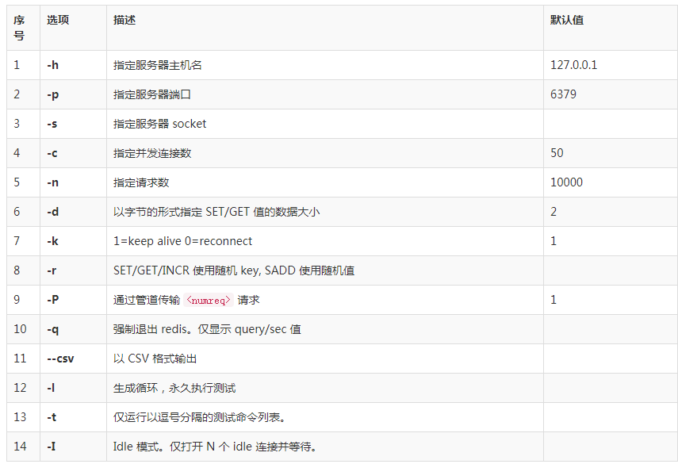

## REDIS 

[Redis performance](http://www.redis.net.cn/tutorial/3521.html)

redis 性能测试的基本命令如下：

    redis-benchmark [option] [option value]

以下实例同时执行 10000 个请求来检测性能：

~~~
redis-benchmark -n 100000
 
PING_INLINE: 141043.72 requests per second
PING_BULK: 142857.14 requests per second
SET: 141442.72 requests per second
GET: 145348.83 requests per second
INCR: 137362.64 requests per second
LPUSH: 145348.83 requests per second
LPOP: 146198.83 requests per second
SADD: 146198.83 requests per second
SPOP: 149253.73 requests per second
LPUSH (needed to benchmark LRANGE): 148588.42 requests per second
LRANGE_100 (first 100 elements): 58411.21 requests per second
LRANGE_300 (first 300 elements): 21195.42 requests per second
LRANGE_500 (first 450 elements): 14539.11 requests per second
LRANGE_600 (first 600 elements): 10504.20 requests per second
MSET (10 keys): 93283.58 requests per second

~~~

redis 性能测试工具可选参数如下所示：

| 序号        | 选项           | 描述  |默认值  |
| ------------- |:-------------:| -----:| -----:|
| 1      | -h | 指定服务器主机名 |127.0.0.1|

以下实例我们使用了多个参数来测试 redis 性能：

~~~
redis-benchmark -h 127.0.0.1 -p 6379 -t set,lpush -n 100000 -q
 
SET: 146198.83 requests per second
LPUSH: 145560.41 requests per second

~~~

## Elasticsearch

[Elasticsearch performance](https://www.elastic.co/blog/announcing-rally-benchmarking-for-elasticsearch)

## Hystrix

